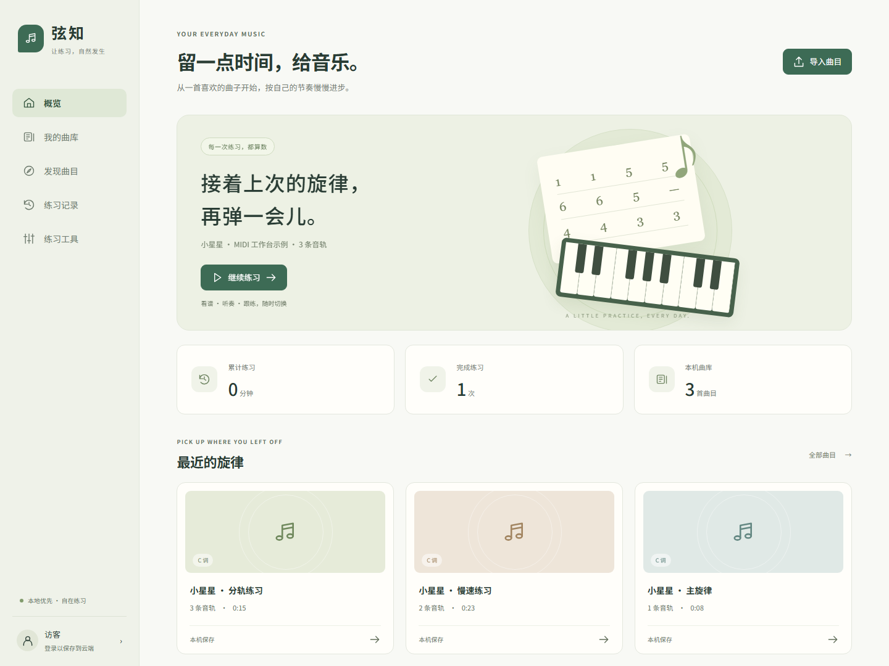
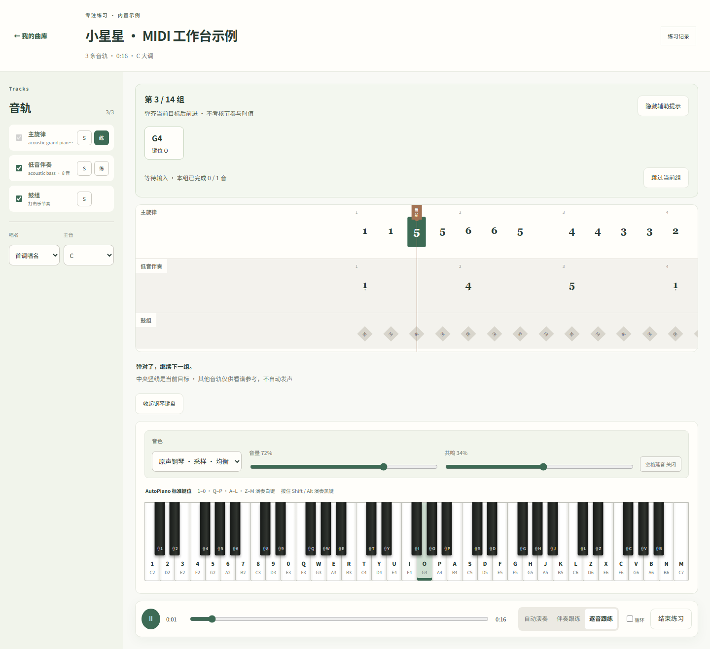
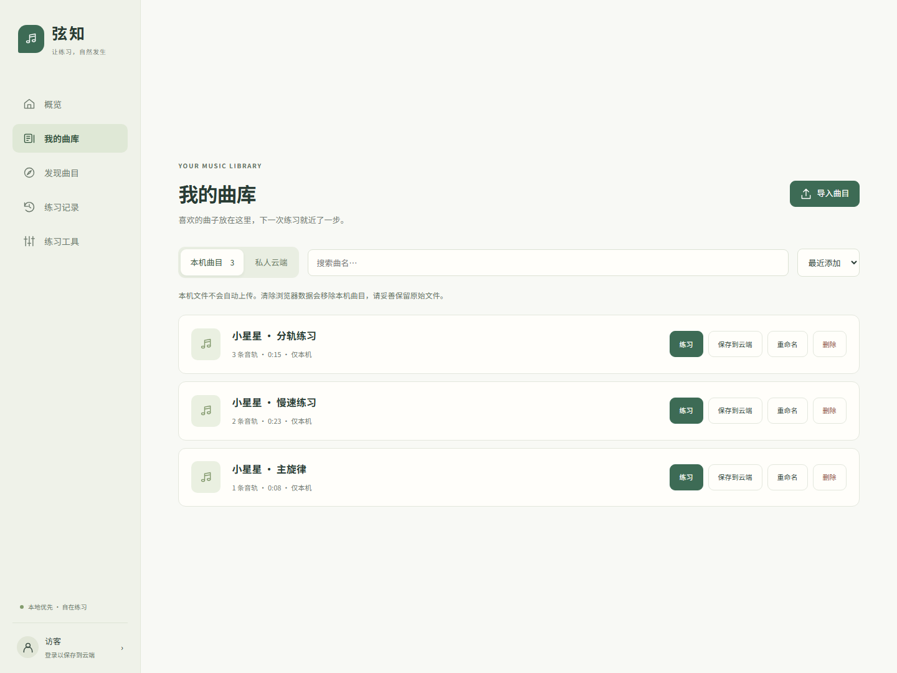
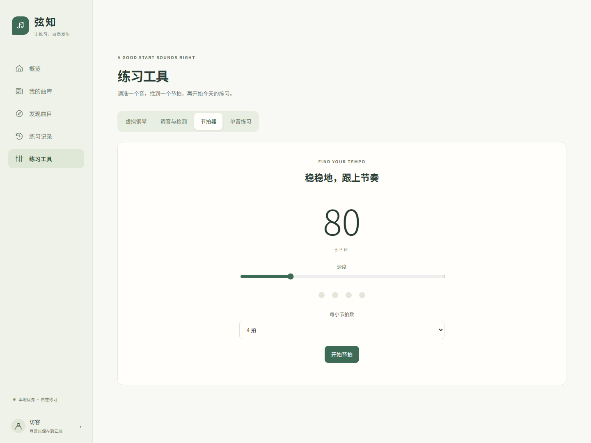
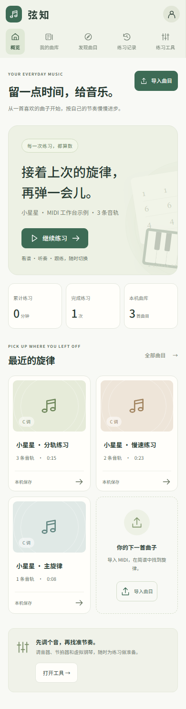
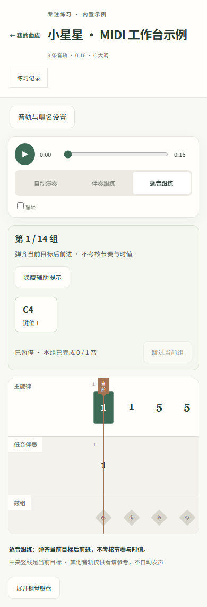

# 弦知 · 让练习自然发生

**从一首喜欢的曲子开始，按自己的节奏慢慢进步。**

弦知是一款面向音乐爱好者的练琴与曲谱平台。你可以导入 MIDI、整理自己的曲库，在分轨简谱中听奏、认谱和练习，也可以直接用电脑键盘或屏幕琴键试弹。练习结束后，平台会保留真实的练习记录，方便下次继续。

项目采用暖白与柔和绿色的界面设计，优先照顾桌面练习体验，同时适配手机。无需注册，即可体验本机导入与练习；当你需要跨设备保存或公开分享时，再选择使用账号与云端功能。

[主要功能](#主要功能) · [界面预览](#界面预览) · [快速开始](#快速开始) · [部署与开发](#部署与开发) · [项目文档](#项目文档)



## 主要功能

### 让曲谱跟上你的练习节奏

- **自动演奏**：听一遍完整曲目，观察分轨简谱与琴键同步变化；支持变速、循环、静音与独奏。
- **伴奏跟练**：选定一条目标音轨，将它静音，跟随其他音轨的伴奏演奏。
- **逐音跟练**：曲谱停在当前目标，弹对后才前进。和弦可以按任意顺序逐个弹齐，弹错时保留已经完成的音；连续同音需要松开后重新按下。
- **清晰的辅助提示**：显示目标音名、电脑键位和对应琴键，也可隐藏提示，专注读谱。支持首调／固定调切换、拖动定位与折叠键盘。

逐音跟练适合先熟悉音符和键位，不考核节奏与时值。暂停时保留当前位置，范围外音符可主动跳过；具体规则请参阅[逐音跟练说明](docs/step-practice.md)。

### 把喜欢的曲子整理在一起

本机曲库支持 MIDI 导入、搜索、排序、重命名与删除。文件和解析结果保存在当前浏览器中，刷新后仍可继续使用；应用加载完成后，即使 API 服务不可用，也不影响本机导入与练习。

配置后端并登录后，可以主动将曲目保存到私人云端，在其他浏览器中重新打开；也可以填写权利声明、提交公开审核，让曲目通过固定链接分享给他人。

### 记录每一次实际练习

概览与练习记录页面展示实际产生的会话和有效时长。普通听奏不计入练习，暂停和切到后台的时间也会排除。逐音模式中的认谱等待计入练习时长，不会被误当作错误输入。

伴奏跟练和逐音跟练的历史记录以过程和时长为主，不提供未经验证的音准或节奏评分。

### 随手可用的练习工具

- **虚拟钢琴**：支持电脑键盘和点击／触摸演奏，提供音色、音量、共鸣与延音控制。
- **节拍器**：可调整速度与每小节拍数，练习稳定的节奏。
- **调音与设备检测**：在浏览器允许使用麦克风时，进行单音音高检测。
- **单音练习**：提供 C 大调五音的麦克风练习入口；设备能力不足或权限未开启时，页面会说明原因。

### 账号与内容管理

云端部分包括注册登录、显示名称与音频偏好、私人曲库、练习记录保存，以及公开曲目的搜索、排序和分页。管理员可预览曲谱、批准或驳回发布申请、处理举报、下架内容，并查看操作记录。

## 界面预览

以下图片均来自项目实际运行界面，使用内置《小星星》及由它生成的主旋律、慢速、分轨练习示例。截图中的记录由实际操作产生，不包含个人账号信息。桌面截图宽度为 1440px，手机截图宽度为 390px。

### 逐音跟练工作台

左侧选择音轨，中间查看简谱，下方使用虚拟钢琴与播放控制。当前目标停在中央线上，完成后进入下一组。



<details>
<summary><strong>查看曲库与节拍器</strong></summary>

本机与云端曲目分别管理，常用的练习、重命名和保存操作集中在曲目旁。



节拍器提供明确的速度、拍数和开始／停止控制。



</details>

<details>
<summary><strong>查看手机界面</strong></summary>

手机使用紧凑导航，音轨设置可以展开或收起，谱面支持横向拖动。右图收起了钢琴键盘，便于查看谱面。

<p>
  
  
</p>

</details>

## 快速开始

如果你想先体验界面与本机练习，只需启动前端，无需先配置数据库或对象存储。建议使用 Node.js 22，与项目 Docker 构建环境保持一致。

```sh
git clone https://github.com/jinjian-liu/music-21-web.git
cd music-21-web
npm ci
npm run dev -- --host 127.0.0.1
```

打开终端显示的地址，默认是 [http://127.0.0.1:5173](http://127.0.0.1:5173)。也可以直接进入[《小星星》示例工作台](http://127.0.0.1:5173/midi/demo)。这些地址指向你自己启动的本地服务，并非线上演示站。

第一次使用，可以按下面的步骤试一试：

1. 打开内置示例，或通过“导入曲目”选择自己的 MIDI 文件。
2. 先使用“自动演奏”听一遍，再用音轨旁的“练”选择目标音轨。
3. 切换到“逐音跟练”，点击开始练习，按提示弹奏当前目标。
4. 结束后前往“练习记录”，查看本次有效练习时长。
5. 如需跨设备访问，再配置后端、登录账号，并主动保存到云端。

## 数据如何保存

**本机保存与云端保存由你自行选择。** 登录账号不会自动上传本机内容。

- 本机 MIDI、解析结果、练习记录和工作台偏好使用 IndexedDB 保存。清除浏览器数据会移除这些副本，建议保留原始 MIDI 文件。
- 保存曲目到云端时上传原始 MIDI；保存练习记录时上传曲目、模式、时间与有效时长等会话信息，不上传录音。
- 解析进度与发布状态分别管理。上传失败不会改变本机成果；公开发布需要可用的解析结果与权利声明，并经过审核。
- 旧浏览器数据中仍可读取的曲目会尝试迁移；如果只剩访问索引，页面会提示重新导入。服务端增量迁移保留已有账号、曲目 ID、分享链接与对象路径。

这里的“本机可用”指已加载的应用不依赖 API 完成核心练习，当前版本尚未提供完全离线启动的 PWA 缓存。

## 部署与开发

前端使用 **React 19、TypeScript 和 Vite**；API 使用 **Fastify**；数据由 **PostgreSQL** 与 **S3 兼容对象存储**保存。浏览器与服务端共享 MIDI 解析逻辑、曲谱格式及接口类型，解析 Worker 独立运行。

### 在本地启用完整功能

1. 将 `.env.example` 复制为 `.env`，按环境填写配置。
2. 运行 `docker compose up -d`，启动 PostgreSQL、MinIO 与私有桶初始化。
3. 运行 `npm run db:migrate`，应用增量迁移。
4. 分别在三个终端运行 `npm run dev:server`、`npm run dev:worker` 和 `npm run dev`。
5. 如需体验管理后台，请先注册账号，再运行 `npm run admin:create -- 你的邮箱` 配置管理员角色。

### 使用 Docker Compose

准备好环境配置后，可一起启动 Web／反向代理、API、Worker、PostgreSQL 和 MinIO：

```sh
docker compose --profile app up --build -d
```

默认访问 [http://127.0.0.1:8080](http://127.0.0.1:8080)。数据库迁移会先于 API 和 Worker 执行。服务器配置、HTTPS、对象存储地址、备份和恢复步骤请参阅[部署说明](docs/deployment.md)。

已有部署升级时，请一并更新前后端并执行增量迁移。逐音跟练记录需要 `0003_step_practice.sql`，无需重建数据库。

### 代码结构

```text
src/
  pages/          页面与工作台
  features/       练习等业务逻辑
  components/     应用布局、谱面、键盘与共享组件
  audio/          播放、合成与麦克风输入处理
  lib/            API、本机数据与云端保存
shared/           共享 MIDI 解析、数据类型与接口契约
server/
  routes/         HTTP 路由与参数校验
  services/       业务规则与状态转换
  migrations/     增量数据库迁移
  worker.ts       独立任务入口
deploy/           反向代理配置
docs/             功能、接口、部署与验证文档
```

### 验证方式

```sh
npm test
npm run build
npx playwright install chromium
npm run test:e2e
```

截至 2026-10-09，逐音跟练版本已通过 **43 项单元／接口测试、12 项浏览器测试及完整构建**。测试覆盖输入判定、暂停计时、本机持久化、云端状态规则和主要页面流程。

API 集成测试使用 PGlite，浏览器验收使用 Chromium；真实 S3、独立多进程 Worker 和实物音频设备的验证范围见[验证记录](docs/verification.md)。

## 当前范围与后续改进

当前版本专注于 MIDI 曲库、看谱听奏、分轨练习与记录。系统课程、AI 教学、外接 MIDI 键盘输入和多乐器复音评分尚未实现。调音与单音检测的体验会受到麦克风、环境噪声及浏览器支持的影响。

欢迎通过 [Issues](https://github.com/jinjian-liu/music-21-web/issues) 反馈使用体验或提出建议。如果遇到问题，请尽量说明操作步骤、浏览器与设备信息，并附上必要的界面截图；如涉及曲目文件，请确认你有权分享。也欢迎通过 Pull Request 帮助改进文档、交互或测试。

## 项目文档

- [实现与产品边界](docs/implementation.md)：页面、数据流程及当前实现范围。
- [逐音跟练使用与规则](docs/step-practice.md)：输入判定、暂停、循环与记录方式。
- [接口约定](docs/api.md)：账号、曲库、练习和审核接口。
- [部署、迁移与恢复](docs/deployment.md)：本地开发与服务器部署步骤。
- [验证结果与环境限制](docs/verification.md)：已完成的检查及待验证范围。
- [截图说明与更新方法](docs/screenshots/README.md)：界面截图来源与复现步骤。
- [第三方许可与致谢](THIRD_PARTY_NOTICES.md)：钢琴采样及相关依赖的来源说明。

感谢你关注弦知。希望它能让每一次打开曲谱，都成为轻松开始练习的机会。
